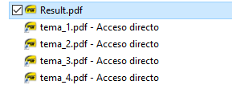
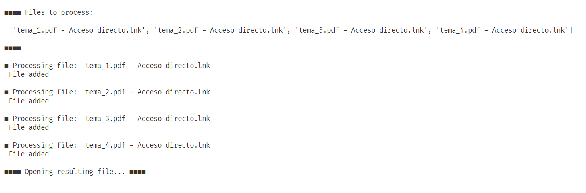
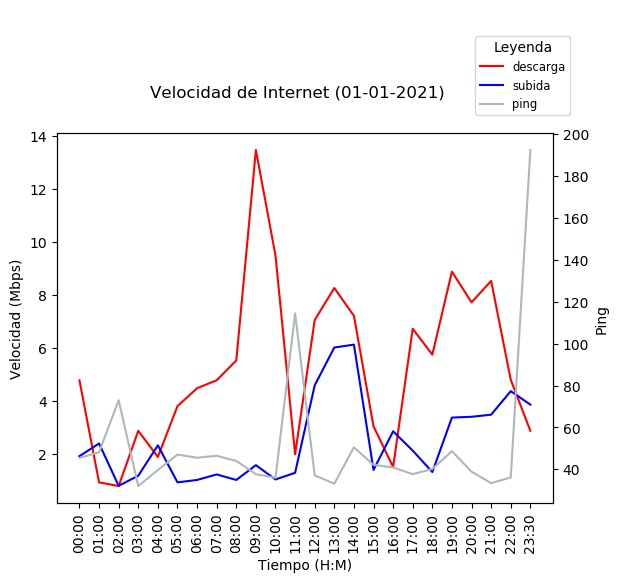

# Python 3 projects 

What you will find here: short Python 3 projects that I use everyday, sorted into folders. 

Mainly to monitor things and keep me informed using Telegram messages. 

And it's usually run in a Raspberry Pi device I have always on :)

## Files Operations

### Merge PDFs

>It’s used to merge independent PDF files into a single document. Useful when each file is frequently updated and is in a different location. By using shortcuts to each file, you avoid searching or moving them from their respective folders.

 

How it works:

1. Create shortcuts to each PDF you want to merge in the same location where the script is located.

1. Execute the Python script in a terminal `python merge_pdfs.py`.

1. When the merge operation is finished, the final PDF (called **Result.pdf**) should launch in your default PDF viewer.

<br>

Terminal output:

 

## Webmonitor

>It's a messy scrapper to keep track of certain projects, and message me when they are updated. It's not intended to be pretty or pythonic, just useful.

How it works:

1. The script (`webmonitor.py`) is launched at the same hour every day via a `cron job`.

1. It dumps today scrapped data into a file (`versiones.txt`) and later compares it to yesterday data (`b-versiones.txt`)

1. If a change it's detected (the comparision between the files is done line-by-line) the changes are being sent via a Telegram message.

It keeps track of: [Android-x86](https://www.android-x86.org/), [ASUS RT-68U firmware](https://www.asus.com/es/Networking/RTAC68U/HelpDesk_BIOS/), [Calibre](https://calibre-ebook.com/whats-new), [LibreOffice](https://libreoffice.org/), [Inkscape](https://inkscape.org/) and more.


## Speedmonitor

>It's used to check how fast are my Internet speed from hour to hour. Making a nice graph with the data it's a nice way to keep track of changes. Currently just to keep me informed, but I plan to add notifications to get informed when it descends below a certain value.

How it works:

1. Do a **speedtest** every hour and log the results into a csv file (`speedmonitor.py`).

1. At a later time, make a graph with **matplotlib** and send it via **Telegram**'s bot (`graph.py`). 

1. At last, a script to **keep everything organized** when yesterday's data are not longer needed (`move.py`).

`cron` is used to launch the scripts at the appropiate time. For example, in case of `speedmonitor.py` the crontab file has this line (it means it's executed every hour):

```0 * * * * python3 $HOME/scripts/speedmonitor/speedmonitor.py ```

Example of the graph generated:
